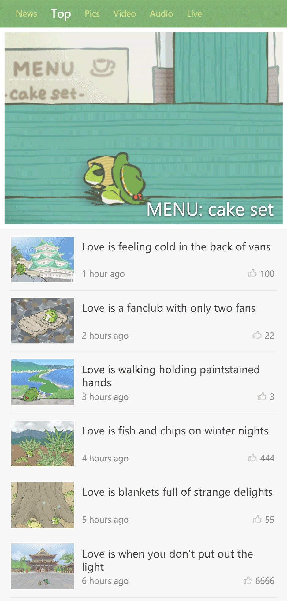

rem-demo
===

使用 rem 代替 px，图片素材取自 HIT-POINT 的游戏：旅かえる

``` scss
@function px2rem($px) {
  $rem: 37.5px;
  @return ($px / $rem) + rem;
}
```


Preview
---




How to use
---

``` bash
$ git clone https://github.com/carolyicheng666/rem-demo.git

$ cd rem-demo && npm install
```

development environment: 
``` bash
$ npm run dev
```

production environment:
``` bash
$ npm run build
```
